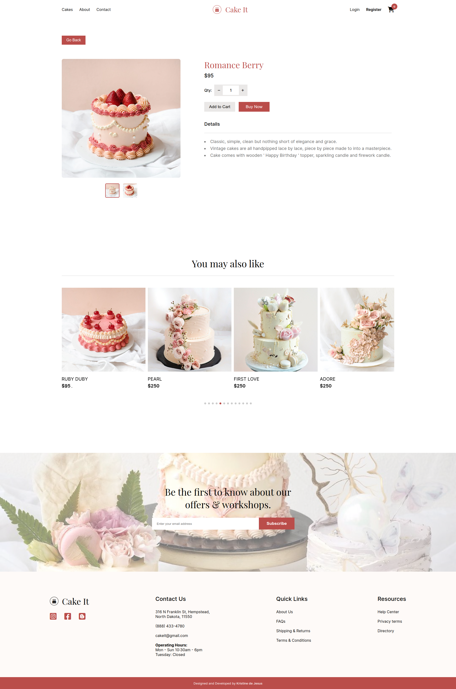

Cake It (Cake Shop E-Commerce)
An e-commerce shop for cakes and desserts.
The UI is based on - Github - @sn-tin, but my team and I developed the functions, database, backend, and more.

TO FIX: Stripe payment integration
!Back-end for this web is https://github.com/aprilboiz/cakeshop.git

📖 Table of contents
Overview

Features

Screenshot

Built with

Running the App Locally

Links

Author

🔍 Overview
Features 📂
Users should be able to:

Filter cakes by categories (Wedding, Vintage or Monogram)

Click the list of cakes and take them to a different page with the Cake details such as prices and specifications

Add to cart and buy the products

Fill in the form on the CTA section for the shop's newsletter

Screenshot 📸

Built with 🔨
Frontend:

MaterialUI

SCSS

Mobile-first workflow

ReactJS (JXS, Hooks, Routing, Context API)

npmjs

Goole Fonts

Fontawesome

Backend:

Java

Database:

MySQL

Containerization:

Docker (used to connect to server)

Running the App Locally 💻
This app runs on Node.js. If Node.js is installed, you may clone the repository and install its dependencies:

npm install
Use code with caution.
Links 🔗
Solution URL: https://github.com/sn-tin/cake-shop

Live Site URL: https://cakeit-shop.vercel.app/

👩‍💻 Author
Github - @sn-tin

How to run the app
Use this command to download the node module

npm i
Then run this in terminal

cd store
then run this command

npm start to run the server
Enjoy :"3
