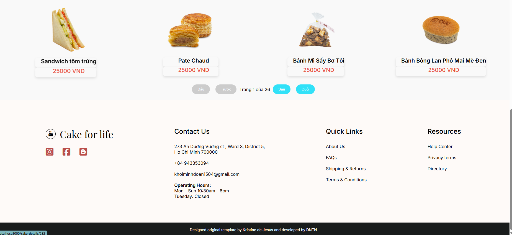

# Cake It (Cake Shop E-Commerce)

An e-commerce shop for cakes and desserts.
The UI is based on - Github - [@sn-tin](https://github.com/sn-tin/), but my team and I developed the functions, database, backend, and more.

## TO FIX: Stripe payment integration

!Back-end for this web is https://github.com/aprilboiz/cakeshop.git

## 📖 Table of contents
  - [Overview](#overview)
    - [Features](#features)
    - [Screenshot](#screenshot)
    - [Built with](#built-with)
    - [Running the App Locally](#running-the-app-locally)
    - [Links](#links)
- [Author](#author)

## 🔍 Overview

### Features 📂

Users should be able to:

- Filter cakes by categories (Wedding, Vintage or Monogram)
- Click the list of cakes and take them to a different page with the Cake details such as prices and specifications
- Add to cart and buy the products
- Fill in the form on the CTA section for the shop's newsletter

### Screenshot 📸

### Built with 🔨

- **Frontend:**
  - MaterialUI
  - SCSS
  - Mobile-first workflow
  - ReactJS (JXS, Hooks, Routing, Context API)
  - [npmjs](https://www.npmjs.com/)
  - [Goole Fonts](https://fonts.google.com/knowledge)
  - [Fontawesome](https://fontawesome.com/)
- **Backend:**
  - Java
- **Database:**
  - MySQL
- **Containerization:**
  - Docker (used to connect to server)

### Running the App Locally 💻
This app runs on Node.js. If Node.js is installed, you may clone the repository and install its dependencies:

npm install
Use code with caution.
Markdown
Links 🔗
Solution URL: https://github.com/sn-tin/cake-shop

Live Site URL: https://cakeit-shop.vercel.app/

👩‍💻 Author
Github - @sn-tin

How to run the app
Use this command to download the node module:

npm i
Use code with caution.
Bash
Then run this in terminal:

cd store
Use code with caution.
Bash
Then run this command:

npm start
Use code with caution.
Bash
Enjoy :"3
